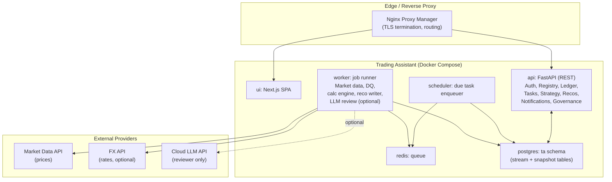
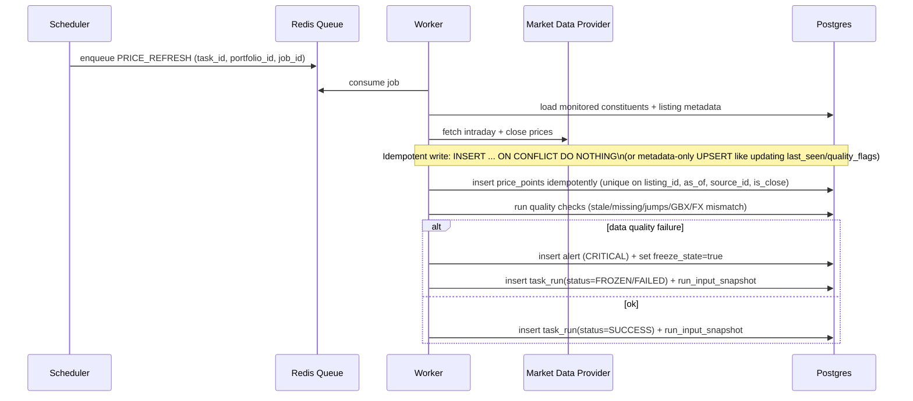
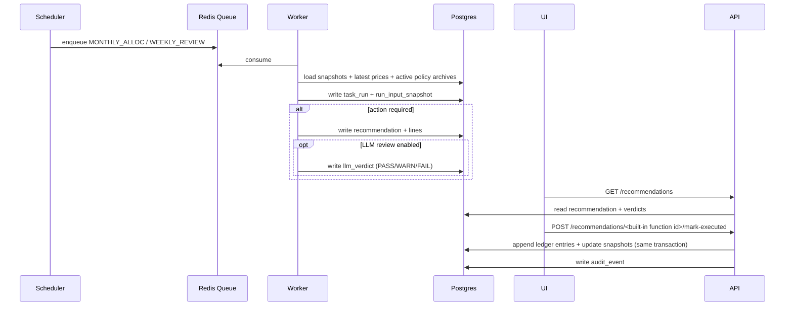

# Trading Assistant — High-Level Design (HLD)

_Last updated: 2026-02-14 (UTC)_

## 1. Purpose

This HLD consolidates the decisions and designs from steps 1–7 into a single narrative describing **what we are building**, **why**, and **how it works at a high level**.

Primary goals:
- Provide an **auditable, deterministic** trading assistant for a long-term SIPP-style portfolio.
- Automate the routine: **ingest → validate → run → recommend → review → execution capture → audit**.
- Keep V1 **portable, secure, and simple**: Docker Compose, homelab-friendly, minimal moving parts.

---

## 2. Scope

### 2.1 In-scope (V1)
- Multi-user authentication (no RBAC; tenancy enforced by portfolio ownership/membership).
- Instrument/listing registry; portfolio constituents mapping listing→sleeve; monitoring list.
- Market data ingestion (intraday + EOD) from a single provider + optional FX for validation.
- Data quality gate (stale/missing/jump/scale/currency mismatch) with **alerts + freeze**.
- Book of record: append-only ledger, **incremental snapshots updated in the same transaction**.
- Deterministic calculation engine for drift/cadence allocation + friction constraints.
- Recommendations UI + “mark executed” workflow (manual broker execution, then capture fills).
- Audit trail for all key actions.
- Notification feed via DB-backed polling endpoint.

### 2.2 Deferred to V2 (explicit)
- Backtesting / UC-90 dry-run simulation (historical sourcing/reporting).
- Full corporate actions beyond split/merge MVP (complex merges, ISIN changes, spin-offs).
- Multi-provider market data failover and more channels (Email/Telegram/Slack/WebPush).
- Multi-currency cash ledger.
- Portfolio sharing (N:M) if not required immediately.
- DB partitions and JSONB GIN indexes (only if real scale/query pressure exists).
- Admin “rebuild snapshots from ledger” tool.

---

## 3. Key design principles

1. **Deterministic engine is authoritative**  
   Cloud LLM provides advisory review only (PASS/WARN/FAIL) and never changes state automatically.

2. **Stream vs Snapshot**  
   Immutable streams for truth/audit; mutable snapshots for UI and “current state”.

3. **Everything traces to TaskRun**  
   All recommendations and key actions are attributable to a specific run + policy/manifesto hashes.

4. **Fail-safe by default**  
   Data quality issues raise Alerts and can Freeze the portfolio to prevent bad advice and noise.

5. **Low friction**  
   Policy constraints enforce max orders and minimum trade value to reduce dealing friction.

---

## 4. Strategy inputs (Manifesto + Policy)

### 4.1 Human + machine strategy artifacts
- `docs/manifesto.md` (human-readable rationale and principles)
- `manifesto_policy.json` + `manifesto_policy.schema.json` (machine-executable policy)

V1 uses **file-based active config**, and archives snapshots in DB for reproducibility:
- `policy_archives` and `manifesto_archives` store payloads + hashes.
- TaskRuns reference the exact archive IDs used.

---

## 5. Architecture overview

### 5.1 Container/service view (V1)

### 5.2 Functional capability blocks (summary)
- Identity & Tenancy
- Registry (instruments/listings/constituents)
- Market data ingest + data quality gate
- Book of record (ledger + incremental snapshots)
- Strategy versioning (policy+manifesto archives)
- Scheduling & orchestration (scheduler/worker/queue)
- Deterministic calculation engine + recommendation writer
- Execution capture + audit
- Notifications + dashboards + governance (alerts/freeze)

---

## 6. Data design (CDM → LDM → PDM)

### 6.1 Core data lifecycle model
Two distinct lifecycles:
- **Immutable stream:** market data points, ledger entries, task runs, recommendations, archives, audit events
- **Mutable snapshot:** holding snapshots, cash snapshots, freeze state, “current state” UI read models

### 6.2 Storage
- PostgreSQL single instance
- Primary keys: UUID (UUIDv7 generated by app)
- Time: UTC `timestamptz`
- Retention: snapshots ~12 months; alerts/notifications ~90 days; prices retained indefinitely (small volume)

### 6.3 JSONB usage (V1)
JSONB is used mainly for payload capture (policy archives, run snapshots, rationale).
GIN indexing is **optional** and deferred unless query pressure appears.

---

## 7. Runtime flows (high-level)

### 7.1 Price ingest → quality gate (idempotent)

### 7.2 Task run → recommendation → review → execution capture

---

## 8. Security and controls

### 8.1 Trust boundaries
- DB is not exposed publicly; only internal Docker network.
- Reverse proxy exposes UI and API; API enforces authentication and portfolio tenancy.
- Worker/scheduler run inside the trusted network; least privileges via dedicated DB user.

### 8.2 Secrets
- No secrets in git.
- Use env injection and/or Docker secrets; rotate API keys.
- Separate API keys for market data vs cloud LLM.

### 8.3 Safety guardrails
- Data quality gate blocks advice on suspicious data.
- Freeze/kill semantics halt scheduled actions and suppress noisy notifications until reset.
- Deterministic engine remains authoritative; LLM is advisory only.

### 8.4 Auditability
Immutable log of:
- prices used
- strategy hashes used
- recommendations generated
- approvals/ignores
- executed trades captured
- freeze/unfreeze events

---

## 9. Operational approach

- Scheduler enqueues; worker executes idempotently (safe under retries).
- Backups: daily DB dump + periodic host snapshot.
- Retention jobs remove old run snapshots and old alerts/notifications.
- Observability: structured logs + health endpoints (Phase 6 polish).

---

## 10. Key risks and mitigations

| Risk | Impact | Mitigation (V1) |
|---|---|---|
| Bad market data (scale/currency mismatch) | Wrong advice | DQ engine + alert + freeze; idempotent ingest |
| Duplicate schedules / retries | Double-apply | ON CONFLICT for prices; idempotent job IDs; transactional snapshot updates |
| Over-trading / friction | Poor outcomes | Max orders + min trade + cadence allocator |
| LLM hallucinations | Bad guidance | LLM reviewer-only; store verdict; user confirmation required |
| Security exposure | Account/portfolio risk | No DB exposure; secrets mgmt; tenancy checks; TLS via reverse proxy |
| Snapshot drift over time | Inconsistent UI state | V1 incremental updates; V2 rebuild tool if needed |

---

## 11. Delivery roadmap (summary)

See `delivery_plan.md` for the full roadmap. In short:
- Phase 0: Dev foundation
- Phase 1: Auth + registry
- Phase 2: Market data + DQ gate
- Phase 3: Ledger + **incremental snapshots**
- Phase 4: Calc engine + recommendations
- Phase 5: Execution capture + audit
- Phase 6: Ops polish

---

## 12. Document set and references

- Use Cases: `use_case.md`
- Manifesto: `docs/manifesto.md`
- Policy: `manifesto_policy.json`, `manifesto_policy.schema.json`
- Conceptual data model: `conceptual_data_model.md`
- Logical data model: `logical_data_model_updated.md`
- Physical data model: `physical_data_model.md`, `physical_data_model_v2.md`, `schema_v2.sql`, `retention.sql`
- Functional architecture: `functional_architecture_updated.md`
- Delivery plan: `delivery_plan.md`

