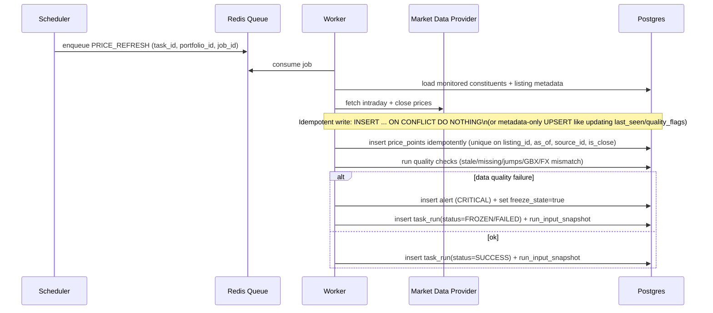
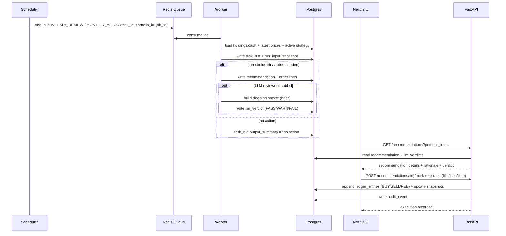
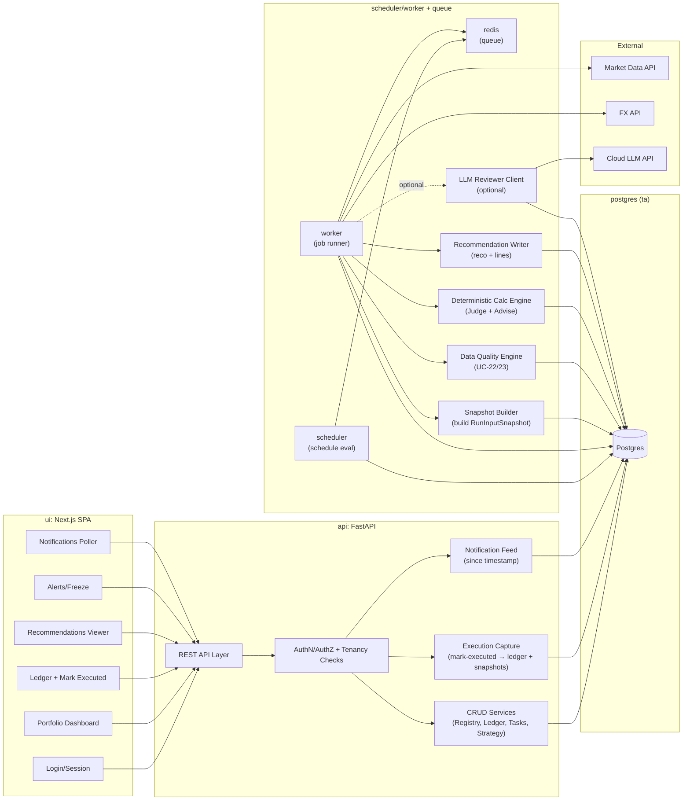

# Trading Assistant — Functional Architecture (Draft)

_Last updated: 2026-02-14 (UTC)_

This document defines the **Functional Architecture** for V1: the major functional blocks, their responsibilities, key interactions, and traceability to the V1 use cases and policy/manifesto model.

It sits **between**:
- the Use Cases (UC-xx)
- the Conceptual/Logical Data Models (CDM/LDM) and PDM
- the High-Level Technical Design (HLD-T)

---

## 1) Functional principles (V1)

1. **Deterministic engine is authoritative**  
   The rules engine produces the recommendation; Cloud LLM is a reviewer only.

2. **Stream vs Snapshot**  
   Immutable streams for truth/audit; snapshots for UI performance and “current state”.

3. **Everything is traceable to a TaskRun**  
   A recommendation must reference a run; a run references policy+manifesto hashes (via strategy version).

4. **Fail-safe by default**  
   Data quality anomalies raise Alerts and can Freeze the portfolio to prevent bad advice spam.

5. **Low friction operations**  
   Recommendations are constrained by policy (max orders, min trade, cadence rules).

---

## 2) Functional decomposition (capability blocks)

### 2.1 Identity & Tenancy
**Purpose:** user authentication and portfolio tenancy.

Functions:
- Sign-in / Sign-out
- Bootstrap admin (create/disable users, reset password)
- Portfolio ownership / optional membership

Use cases:
- UC-01, UC-02, UC-03

Primary data:
- users, portfolios, portfolio_memberships

---

### 2.2 Registry (Instrument & Portfolio Universe)
**Purpose:** define “what exists” and “what is monitored”.

Functions:
- Maintain instrument registry (ISIN canonical)
- Maintain listings/venues (ticker/exchange/currency/scale)
- Map portfolio constituents (listing → sleeve)
- Configure monitoring flags

Use cases:
- UC-10, UC-11

Primary data:
- instruments, instrument_listings, sleeves, portfolio_constituents

---

### 2.3 Book of Record (Ledger & Snapshots)
**Purpose:** internal truth of holdings and cash; derived state from immutable events.

Functions:
- Maintain ledger batches (grouping/context)
- Maintain ledger entries (trades, contributions, fees)
- Maintain holding snapshots (derived, persisted)
- Maintain cash snapshot (GBP for V1)
- Apply corporate actions (split/merge) as state adjustments

Use cases:
- UC-12, UC-13, UC-14, UC-15

Primary data:
- ledger_batches, ledger_entries, holding_snapshots, cash_snapshots, corporate_actions

---

### 2.4 Market Data Ingestion & Validation
**Purpose:** ingest external prices/FX and prevent bad data from triggering bad advice.

Functions:
- Manual refresh (on demand)
- Scheduled refresh (intraday + close)
- FX ingestion (for mismatch detection)
- Data quality checks:
  - stale/missing prices
  - abnormal jumps
  - market-closed awareness
  - unit/scale consistency (GBP vs GBX)
  - currency mismatch checks

Use cases:
- UC-20, UC-21, UC-22, UC-23

Primary data:
- price_points, fx_rates, market_data_sources, alerts, freeze_states

---

### 2.5 Strategy & Policy Management (Manifesto + Machine Policy)
**Purpose:** manage strategy rules as versioned artifacts, file-based in V1, DB archived for reproducibility.

Functions:
- View active Manifesto + Policy
- Create draft strategy version from current files
- Validate policy schema (sum to 100%, thresholds, constraints)
- Approve strategy version (make active)
- Archive policy+manifesto payloads and hashes

Use cases:
- UC-30, UC-31, UC-32, UC-33

Primary data:
- policy_archives, manifesto_archives, strategy_versions, sleeve_targets

---

### 2.6 Scheduling & Orchestration
**Purpose:** define tasks and execute them reliably and repeatably.

Functions:
- Define tasks (cron/RRULE, modules, enabled, scope)
- Scheduler computes due runs and enqueues jobs
- Worker executes jobs idempotently
- Each run writes TaskRun + InputSnapshot + outputs (recommendation/alerts)

Use cases:
- UC-40, UC-41, UC-42

Primary data:
- task_definitions, task_runs, run_input_snapshots

---

### 2.7 Calculation Engine (Deterministic “Judge”)
**Purpose:** compute portfolio state, evaluate triggers, and generate deterministic advice.

Core calculations:
- valuation in base currency (GBP)
- sleeve weights and drift
- drawdown / “wave trigger” detectors
- friction filter (min trade size; max order count)
- allocation logic for monthly/quarterly cadence rules
- constraint compliance report (max orders, forbidden instruments, etc.)

Use cases:
- UC-41, UC-42, UC-50

Primary data:
- run_input_snapshots (input), recommendations (output), recommendation_lines (output)

---

### 2.8 Recommendation Review & Execution Capture
**Purpose:** provide human-in-the-loop review, then record execution back into ledger.

Functions:
- Present recommendation in UI with rationale + triggered rules
- Mark executed with fills/fees/time → produce ledger entries and refresh snapshots
- Allow ignore/acknowledge with audit trail

Use cases:
- UC-51, UC-52

Primary data:
- recommendations, recommendation_lines, ledger_entries, audit_events

---

### 2.9 LLM Review (Non-authoritative)
**Purpose:** sanity-check the deterministic plan and/or manifesto.

Functions:
- Build “decision packet” from run + policy + proposed orders
- Request LLM review → store PASS/WARN/FAIL + response
- Display verdict in UI; no auto-changes
- Optional: LLM review of draft manifesto/policy changes

Use cases:
- UC-60..UC-64

Primary data:
- llm_verdicts

---

### 2.10 Notifications, Reporting, and Governance
**Purpose:** inform the user, provide dashboards, and keep the system safe.

Functions:
- Notification feed (polling) from UI
- Reports: value, weights, drift history, drawdown, past recommendations
- Alerts: persistent issues requiring resolution
- Freeze/unfreeze controls
- Immutable audit events for all important actions

Use cases:
- UC-70, UC-71, UC-80

Primary data:
- notifications, alerts, freeze_states, audit_events (+ read models)

---

## 3) Functional components (services/modules)

```mermaid
flowchart TB
  %% =========================
  %% Functional capability blocks (V1)
  %% =========================

  subgraph UI["UI (Next.js SPA)"]
    UI1["Dashboards & CRUD screens\n(Auth, Portfolio, Holdings, Ledger,\nRegistry, Tasks, Recommendations,\nAlerts/Freeze, Strategy)"]
    UIPoll["Notification Feed Poller\n(GET /notifications?since=...)"]
  end

  subgraph API["API (FastAPI) — Functional Modules"]
    Auth["Identity & Tenancy\n(UC-01..03)"]
    Reg["Registry\n(UC-10..11)"]
    BoR["Book of Record\nLedger + Snapshots\n(UC-12..15)"]
    Strat["Strategy & Policy\nVersioning + Validation\n(UC-30..33)"]
    Tasks["Task Definitions + Manual Triggers\n(UC-40..42)"]
    RecoAPI["Recommendation Review & Execution Capture\n(UC-51..52)"]
    Gov["Governance\nAlerts + Freeze + Audit\n(UC-80)"]
    NotifAPI["Notifications Feed\n(UC-70)"]
    Reports["Reporting Read Models\n(UC-71)"]
  end

  subgraph Orchestration["Scheduling & Execution"]
    Scheduler["Scheduler\n(due tasks → enqueue)"]
    Queue["Redis Queue"]
    Worker["Worker\n(exec jobs)\n(UC-41..42, UC-50)"]
  end

  subgraph External["External Providers"]
    Mkt["Market Data Provider(s)\n(Prices)"]
    FX["FX Provider(s)\n(Rates)"]
    LLM["Cloud LLM Provider\n(Reviewer-only)\n(UC-60..64)"]
  end

  subgraph DB["Postgres (ta schema)"]
    Stream["Immutable Streams\nprice_points, fx_rates,\nledger_entries, task_runs,\nrun_input_snapshots,\nrecommendations, audit_events"]
    Snap["Mutable Snapshots\nholding_snapshots,\ncash_snapshots,\nfreeze_states"]
    Ops["Ops & Messaging\nalerts, notifications,\ntask_definitions,\nportfolio_constituents"]
  end

  %% UI to API
  UI1 --> Auth
  UI1 --> Reg
  UI1 --> BoR
  UI1 --> Strat
  UI1 --> Tasks
  UI1 --> RecoAPI
  UI1 --> Gov
  UI1 --> Reports
  UIPoll --> NotifAPI

  %% API to DB
  Auth --> DB
  Reg --> DB
  BoR --> DB
  Strat --> DB
  Tasks --> DB
  RecoAPI --> DB
  Gov --> DB
  NotifAPI --> DB
  Reports --> DB

  %% Orchestration
  Scheduler --> Queue
  Worker --> Queue
  Scheduler --> DB
  Worker --> DB

  %% Worker external interactions
  Worker --> Mkt
  Worker --> FX
  Worker -. optional .-> LLM

  %% Worker produces core artifacts
  Worker --> Stream
  Worker --> Ops
  Worker --> Snap
```

### 3.1 UI (Next.js SPA)
Major screens:
- Auth (login/logout)
- Portfolio dashboard (value, sleeves, drift, status)
- Holdings & cash (snapshot + provenance)
- Ledger (batches + entries; “mark executed” workflow)
- Registry (instruments/listings/constituents)
- Tasks (definitions, enable/disable, run history)
- Recommendations (details + LLM verdict + execute/ignore)
- Alerts & Freeze controls
- Strategy (view active, draft/approve; show hashes)

UI integrates only via REST to API; notification feed via polling.

---

### 3.2 API (FastAPI) — functional modules
- **Auth module**: sessions, password resets, bootstrap admin
- **Tenancy module**: portfolio ownership/membership checks
- **Registry module**: instruments/listings/constituents CRUD
- **Ledger module**: batches/entries CRUD; snapshot recompute endpoints (internal)
- **Strategy module**: versioning, archive storage, schema validation
- **Tasks module**: task definitions CRUD; manual trigger endpoint
- **Runs/Reco module**: read run history; read recommendations; mark executed
- **Governance module**: alerts, freeze/unfreeze, audit logging
- **Notifications module**: polling feed endpoint

---

### 3.3 Scheduler (service)
- Loads enabled tasks
- Evaluates CRON/RRULE
- Enqueues job messages (task_id, portfolio_id, job_id, due_at)
- Observes freeze state (skip enqueue or enqueue “skip if frozen”)

---

### 3.4 Worker (service)
Workers execute jobs through these internal modules:
- **Market Data Adapter(s)** (provider abstraction)
- **FX Adapter(s)** (provider abstraction)
- **Data Quality Engine**
- **Snapshot Builder** (constructs RunInputSnapshot)
- **Calculation Engine** (judge + advise)
- **Reco Writer** (recommendations + lines)
- **LLM Adapter** (optional)
- **Notification Emitter** (writes notifications rows)
- **Audit Writer** (writes audit_events for key actions)

---

## 4) Key end-to-end flows (functional)

### 4.1 Price ingest + quality gate

**Idempotency refinement (important):** price ingestion must be safe under retries and duplicate scheduling.
- Use a uniqueness constraint on `(listing_id, as_of, source_id, is_close)` (already in PDM).
- Write prices with `INSERT ... ON CONFLICT DO NOTHING` to tolerate duplicate jobs.
- Optionally, maintain a `last_seen_at` (future enhancement) or update non-price metadata (e.g., `quality_flags`) with `ON CONFLICT DO UPDATE` **without changing** the recorded price value.

Example pattern:
- `ON CONFLICT (...) DO NOTHING` (strict append-only)
- or `ON CONFLICT (...) DO UPDATE SET quality_flags = EXCLUDED.quality_flags` (metadata-only)

### 4.2 Review run -> recommendation -> execution capture

---

## 5) Traceability: use cases → functional blocks

| Use case | Primary functional blocks |
|---|---|
| UC-01..03 | Identity & Tenancy; API Auth module; UI Auth screens |
| UC-10..11 | Registry; UI Registry screens; API Registry module |
| UC-12..15 | Book of Record; Ledger module; Snapshot builder; Corporate action handler |
| UC-20..23 | Market Data Ingestion & Validation; Adapters; Alerts/Freeze |
| UC-30..33 | Strategy & Policy; Strategy module; schema validation |
| UC-40..42 | Scheduling & Orchestration; Scheduler; Worker |
| UC-50..52 | Calculation engine; Recommendation review/execution |
| UC-60..64 | LLM Review; LLM adapter; verdict storage |
| UC-70..71 | Notifications; Reporting; UI dashboards |
| UC-80 | Governance; FreezeState; Alerts; “kill switch” UI |

---

## 6) Functional interfaces (contracts, not implementation)

### 6.1 Internal job message
Fields (minimal):
- `job_id` (uuid)
- `task_id` (uuid)
- `portfolio_id` (uuid)
- `enqueued_at` (timestamptz)

### 6.2 Decision packet (for LLM review)
Must include:
- active strategy version + policy hash + manifesto hash
- computed state summary (weights/drift/drawdown)
- proposed order lines (ticker/ISIN, amount)
- constraints report + triggered rule codes
- data quality report summary

### 6.3 Notification payload (polling feed)
- `type` (e.g., ALERT_RAISED, RECO_READY, RUN_FAILED)
- `severity`
- `title`
- `body`
- `links` (UI routes, optional)
- `related_ids` (run_id, recommendation_id, alert_id)

---

## 7) Non-functional behaviors (functional implications)

- **Idempotency:** Worker must tolerate replays (queue retries) and duplicate schedules. Dedupe via unique constraints + job/run IDs; for `price_points` use `INSERT ... ON CONFLICT DO NOTHING` (or metadata-only upsert).
- **Determinism:** Given the same RunInputSnapshot and policy version, engine output is reproducible.
- **Safety:** If quality fails, produce Alert and optionally Freeze; recommendations blocked until resolved.
- **Performance:** “latest price” queries and “portfolio recent activity” queries are indexed (see PDM).
- **Auditability:** Every approve/execute/freeze emits an audit event.

---
