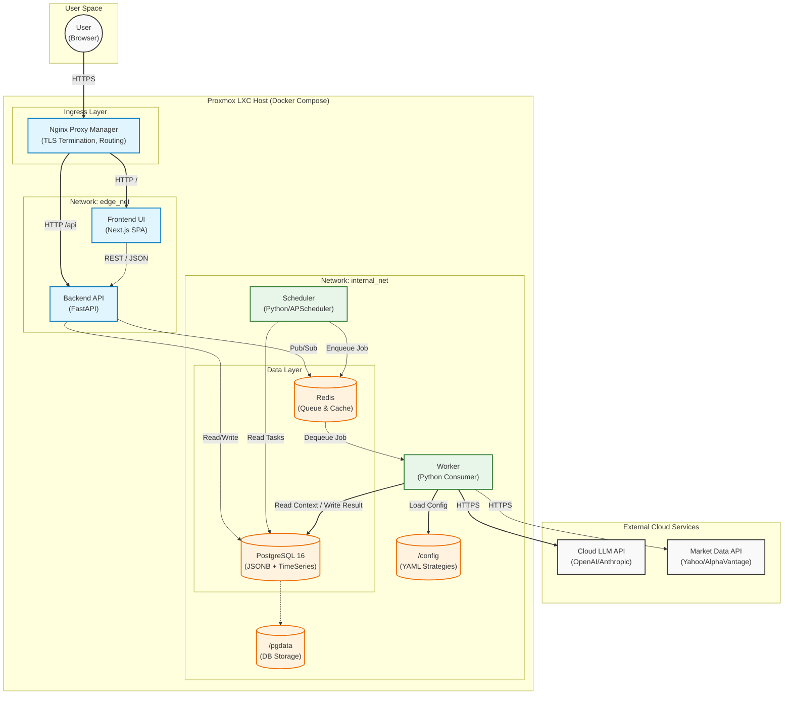

# Trading Assistant — High-Level Technical Design (HLD-T)

_Last updated: 2026-02-14 (UTC)_

This HLD-T defines the **V1 technical architecture** (stack, components, boundaries, interfaces, deployment) for the Trading Assistant. It is written to be directly actionable for implementation and to unblock the **Physical Data Model (PDM/DDL)**.

---

## 0) V1 objectives and constraints

### Primary objectives
- **Reliability + auditability**: append-only stream, reproducible `TaskRun` inputs/outputs, immutable audit trail.
- **Operational simplicity**: minimal moving parts; easy backup/restore; homelab-friendly.
- **Portability**: Docker Compose; no hard cloud dependency (cloud LLM is optional).
- **Security**: DB not exposed; secrets management; TLS at ingress; least-privilege container networking.

### V1 scope decisions (confirmed)
1) **UI**: React SPA (Next.js)  
2) **Notifications**: polling “notification feed” from UI backed by `notifications` table  
3) **Scheduler and Worker**: separated processes  
4) **Deployment**: Proxmox → LXC → Docker Compose; reverse proxy via Nginx Proxy Manager

---

## 1) Technology stack (V1)

### Data layer
- **PostgreSQL** (single instance)
  - Strong referential integrity, JSONB support, time-series-ish indexing.
  - Fits Stream vs Snapshot model cleanly.

### Queue / caching
- **Redis**
  - Queue backend for scheduled jobs and async workloads.
  - Short-lived cache (optional): e.g., latest prices, last successful run markers.

### Backend API
- **Python FastAPI**
  - REST API boundary for all clients (UI, scheduler, worker).
  - Auth/session, CRUD, policy validation, “decision packets”, audit write path.
- **SQLAlchemy + Alembic**
  - Migrations, schema evolution.

### Job execution
- **Scheduler**: enqueues due tasks into Redis (CRON/RRULE).
- **Worker(s)**: consume jobs from Redis; execute idempotent tasks.

> Queue framework options (implementation-level): Celery or RQ.  
> **Design assumes**: queue supports at-least-once delivery; jobs must be idempotent.

### Frontend
- **Next.js SPA**
  - Authenticated UI for holdings/ledger/tasks/recommendations dashboards.
  - Calls FastAPI only (no direct DB access).

### Ingress
- **Nginx Proxy Manager**
  - TLS termination, routing, optional IP allowlisting.

---

## 2) Components and boundaries

### 2.1 Logical components (runtime services)
- **ui** (Next.js)
  - Renders dashboards and CRUD screens.
  - Polls notifications feed.
  - Calls API with session cookie / bearer token.

- **api** (FastAPI)
  - Authentication (UC-01/02/03)
  - CRUD for portfolio, instruments/listings, constituents, ledger, tasks
  - Strategy archive (policy+manifesto hash + payload persistence)
  - Recommendation review and “mark executed”
  - Global safety controls (Freeze)
  - Notification feed endpoint
  - Admin endpoints (bootstrap-only)

- **scheduler**
  - Reads enabled `task_definitions` (or cached schedule plan)
  - Computes due runs
  - Enqueues job messages `{task_id, portfolio_id}` into Redis
  - Respects `freeze_states` (either: do not enqueue, or enqueue with “skip if frozen”)

- **worker**
  - Pulls job message
  - Loads required context from DB (holdings snapshot + latest prices + strategy version)
  - Runs deterministic modules (price refresh, drift calc, rebalance calc)
  - Writes immutable stream records: `task_runs`, `run_input_snapshots`, `alerts`
  - Writes `recommendations` (+ lines) if action required
  - Emits `notifications` rows (UI picks them up via polling)
  - Optionally calls cloud LLM and stores `llm_verdicts`

- **db** (Postgres)
- **redis** (queue)

### 2.2 Trust boundaries
- UI is **untrusted**: it can request, but all decisions/writes must be validated by API.
- Worker and Scheduler are **internal** services; still authenticated to API/DB using service credentials.
- DB is **private** (Docker internal network only).

---

## 3) Primary runtime flows (V1)

### Flow A — Scheduled price refresh (UC-21)
1. Scheduler enqueues `PRICE_REFRESH` task.
2. Worker fetches prices for monitored `portfolio_constituents`.
3. Worker writes `price_points` (append-only).
4. Worker runs data quality checks (UC-22/23); raises `alerts` if needed.
5. Worker writes `task_run` + `run_input_snapshot`.
6. Worker emits notification row (optional, e.g., errors only).

### Flow B — Weekly review-only (UC-41, no trading)
1. Scheduler enqueues `WEEKLY_REVIEW`.
2. Worker computes weights/drift/drawdown using snapshots + latest close prices.
3. If thresholds not met: write `task_run` “no action”.
4. If thresholds met: create `recommendation` (but still requires user approval to execute).

### Flow C — Monthly contribution allocation (≤2 orders)
1. User records contribution in ledger (or via scheduled plan).
2. Scheduler enqueues `MONTHLY_ALLOC`.
3. Worker generates recommendation lines constrained by policy (max orders, min trade).
4. UI shows recommendation. User executes on broker and records fills in UI (UC-52).

### Flow D — Freeze / data anomaly guardrail (UC-80)
1. Worker detects anomaly (e.g., scale mismatch) and raises CRITICAL alert.
2. Worker (or API) sets `freeze_states.is_frozen = true` (snapshot) + writes `audit_event`.
3. Scheduler stops enqueueing (or worker returns status FROZEN).
4. UI shows “Frozen” banner and alert details; user must manually clear.

---

## 4) Interface design (high level)

### 4.1 External API (UI ↔ API) — REST
Suggested endpoint groups (names indicative):

**Auth**
- `POST /auth/login`
- `POST /auth/logout`
- `POST /auth/users` (bootstrap admin only)
- `PATCH /auth/users/{id}` (enable/disable/reset)

**Portfolio & registry**
- `GET/POST /portfolios`
- `GET/POST /instruments`
- `GET/POST /listings`
- `GET/POST /portfolios/{pid}/constituents`

**Ledger**
- `GET/POST /portfolios/{pid}/ledger/batches`
- `GET/POST /portfolios/{pid}/ledger/entries`
- `GET /portfolios/{pid}/holdings` (snapshot)
- `GET /portfolios/{pid}/cash` (snapshot)

**Strategy**
- `GET /strategy/versions`
- `POST /strategy/versions` (create draft from current files)
- `POST /strategy/versions/{id}/approve`
- `GET /strategy/versions/{id}/policy`
- `GET /strategy/versions/{id}/manifesto`

**Tasks**
- `GET/POST /tasks`
- `PATCH /tasks/{id}` (enable/disable/schedule)

**Runs & recommendations**
- `GET /portfolios/{pid}/runs?from=...`
- `GET /recommendations?portfolio_id=...`
- `POST /recommendations/{id}/mark-executed` (records fills → ledger entries)

**Notifications (polling feed)**
- `GET /notifications?since=timestamp`
  - returns notifications for the authenticated user
  - UI polls every N seconds (configurable)

**Safety**
- `POST /portfolios/{pid}/freeze`
- `POST /portfolios/{pid}/unfreeze`

### 4.2 Internal job message (Scheduler → Redis → Worker)
Minimal job payload (example):
```json
{
  "job_id": "uuid",
  "task_id": "uuid",
  "portfolio_id": "uuid",
  "enqueued_at": "2026-02-14T12:00:00Z"
}
```

Worker resolves `task_kind` and loads active strategy version (latest APPROVED) unless task pins a specific version.

---

## 5) Deployment topology (Docker Compose)

### Services
- `ui` (Next.js)
- `api` (FastAPI)
- `scheduler`
- `worker` (replicable)
- `db` (Postgres)
- `redis` (Redis)

### Networking
- `internal_net`: db + redis + api + worker + scheduler
- `edge_net`: api + ui (only these are reachable by reverse proxy)

**Rules**
- No host port mapping for `db` and `redis`.
- Only expose `ui` and `api` via Nginx Proxy Manager.
- Worker/scheduler access db/redis via internal network.

### Storage / persistence
- Postgres volume: `pgdata`
- Optional: `backups/` volume mounted to api or a separate backup container
- Optional: `config/` read-only volume for policy/manifesto files (V1 file-based config)

---

## 6) Security design (V1)

### Authentication
- UI authenticates to API; API issues:
  - **Option A:** HttpOnly session cookie (recommended for SPA simplicity)
  - **Option B:** JWT bearer tokens (works too; more care with storage)

Passwords:
- Argon2id or bcrypt hashing.

### Secrets
- Use `.env` for local dev; for homelab:
  - Docker secrets or an encrypted secret store mounted into LXC.
- Rotate: market data keys, LLM keys.

### Database
- DB only on internal network.
- Least privilege DB user(s):
  - `app_user` (api + worker + scheduler)
  - optional `readonly_user` for diagnostics
- At-rest encryption: host-level (Proxmox datastore / LUKS) preferred.

### TLS
- TLS termination at Nginx Proxy Manager.

---

## 7) Observability and operations

### Logging
- Structured logs for api/scheduler/worker.
- Correlation IDs:
  - `job_id`, `run_id`, `portfolio_id`

### Health checks
- `/health` on api
- scheduler/worker container healthchecks
- redis/db health in compose

### Backups
- Daily `pg_dump` (logical)
- Weekly full volume snapshot (Proxmox-level snapshot ideal)

### Idempotency
- Worker tasks must be safe on retry:
  - Unique constraints on `price_points` and `task_runs` guard duplicates.
  - Use `job_id`/`input_hash` dedupe patterns.

---

## 8) Scaling envelope (V1 → V2 ready)
- Horizontal scale worker: multiple `worker` replicas consuming from Redis.
- Scheduler stays singleton.
- UI/API scale later if needed.

---

## 9) Architecture diagram (Mermaid)



---

## 10) PDM checklist
- Primary key strategy: UUID v7
- Timestamp conventions: UTC TIMESTAMPTZ
- Retention policy for `price_points` and `run_input_snapshots`: Foreever.
- Indexing priorities:
  -Priority 1: (listing_id, as_of DESC) -> For fetching "Latest Price".
    -(listing_id, as_of DESC) WHERE is_close = true
    -keep the uniqueness guardrail:UNIQUE(listing_id, as_of, source_id, is_close)
  -Priority 2: (portfolio_id, created_at DESC) -> For Ledger and Task Runs.
    -Replace “created_at” with the real event time:(portfolio_id, entry_time DESC)
  -Priority 3: (isin) -> For joins.
