# Trading Assistant — Logical Data Model (LDM)

_Last updated: 2026-02-14 (UTC)_

This Logical Data Model translates the **Conceptual Data Model** into a relational design: **entities → tables**, with **keys**, **relationships**, and key **constraints/invariants**. Data types are shown at a logical level (implementation-specific types come in the Physical Data Model / DDL step).

> **Stream vs Snapshot**
> - **Stream (immutable):** append-only, never updated in place.
> - **Snapshot (mutable):** current-state tables updated in place for UI and fast calcs.

---
## 1) Core reference & tenancy

### 1.1 Users and portfolios
**users** *(stream-ish; mutable only for auth fields like last_login, enabled)*  
- `user_id` (PK)  
- `email` (UQ)  
- `password_hash`  
- `is_enabled`  
- `is_bootstrap_admin` *(bootstrap capability, not RBAC)*  
- `created_at`, `last_login_at`

**portfolios** *(stream-ish; mutable rarely)*  
- `portfolio_id` (PK)  
- `owner_user_id` (FK → users)  
- `name`  
- `broker` *(e.g., AJBell)*  
- `base_currency` *(GBP in V1)*  
- `tax_treatment` *(SIPP / ISA / GIA)*  
- `created_at`

**portfolio_memberships** *(optional; N..M access without RBAC)*  
- `portfolio_id` (FK → portfolios)  
- `user_id` (FK → users)  
- `created_at`  
- **PK:** (`portfolio_id`, `user_id`)

---

## 2) Registry (Instrument + Listing)

### 2.1 Canonical instrument (ISIN)
**instruments** *(stream)*  
- `instrument_id` (PK)  
- `isin` (UQ, canonical identity)  
- `instrument_type` *(ETF / STOCK / ETC / FUND, etc.)*  
- `name` *(optional)*  
- `created_at`

### 2.2 Venue/listing (ticker + currency + quote scale)
**instrument_listings** *(stream)*  
- `listing_id` (PK)  
- `instrument_id` (FK → instruments)  
- `ticker` *(e.g., VWRP)*  
- `exchange` *(e.g., LSE; or MIC)*  
- `trading_currency` *(GBP / USD / EUR …)*  
- `quote_scale` *(GBX / GBP / …)*  
- `provider_symbol` *(optional; what the market data provider uses)*  
- `is_primary` *(bool; optional)*  
- `created_at`

> Currency and quote-scale are properties of the **listing**, not only the ISIN (supports UC-23).

---

## 3) Strategy (portable targets) + Portfolio implementation mapping

### 3.1 Sleeves
**sleeves** *(stream; low churn)*  
- `sleeve_code` (PK) *(e.g., CORE, SEMIS, ENERGY…)*  
- `name` *(human label; e.g., “Global Equity”)*  
- `description` *(optional)*

### 3.2 Strategy versions
**strategy_versions** *(stream; versioned)*  
- `strategy_version_id` (PK)  
- `version_label` *(e.g., 1.0.0)*  
- `status` *(DRAFT / APPROVED / RETIRED)*  
- `policy_sha256` *(UQ)*  
- `manifesto_sha256` *(UQ)*  
- `created_by_user_id` (FK → users)  
- `created_at`  
- `approved_at` *(nullable)*

**policy_archives** *(stream, immutable)*  
- `policy_sha256` (PK)  
- `policy_json` *(JSON)*  
- `created_at`

**manifesto_archives** *(stream, immutable)*  
- `manifesto_sha256` (PK)  
- `manifesto_md` *(text)*  
- `created_at`

**sleeve_targets** *(stream; ties strategy→targets)*  
- `strategy_version_id` (FK → strategy_versions)  
- `sleeve_code` (FK → sleeves)  
- `target_weight` *(0..1)*  
- **PK:** (`strategy_version_id`, `sleeve_code`)

> Strategy defines **targets per sleeve**; it does **not** hardcode specific ETFs.

### 3.3 Portfolio constituents (strategy implementation)
**portfolio_constituents** *(stream-ish; mutable only if user edits mapping)*  
- `portfolio_id` (FK → portfolios)  
- `listing_id` (FK → instrument_listings)  
- `sleeve_code` (FK → sleeves)  
- `is_monitored` *(bool)*  
- `include_in_calcs` *(bool)*  
- `created_at`  
- **PK:** (`portfolio_id`, `listing_id`)

---

## 4) Market data (immutable feed)

### 4.1 Market data providers
**market_data_sources** *(stream; low churn)*  
- `source_id` (PK)  
- `name` *(e.g., “Stooq”, “TwelveData”, “BrokerFeed”)*  
- `notes` *(optional)*

### 4.2 Prices
**price_points** *(stream, append-only time series)*  
- `price_point_id` (PK)  
- `listing_id` (FK → instrument_listings)  
- `as_of` *(timestamp)*  
- `source_id` (FK → market_data_sources)  
- `is_close` *(bool)*  
- `raw_price`  
- `raw_currency`  
- `raw_quote_scale`  
- `normalized_price_base` *(e.g., normalized into GBP for V1)*  
- `quality_flags` *(JSON; e.g., stale/scale_suspect/currency_mismatch)*  
- **UQ:** (`listing_id`, `as_of`, `source_id`, `is_close`)

### 4.3 FX rates
**fx_rates** *(stream, time series)*  
- `fx_rate_id` (PK)  
- `base_currency` *(e.g., GBP)*  
- `quote_currency` *(e.g., USD)*  
- `as_of` *(timestamp)*  
- `rate`  
- `source_id` (FK → market_data_sources)  
- **UQ:** (`base_currency`, `quote_currency`, `as_of`, `source_id`)

### 4.4 Corporate actions
**corporate_actions** *(stream)*  
- `corp_action_id` (PK)  
- `instrument_id` (FK → instruments)  
- `action_type` *(SPLIT / MERGE / ISIN_CHANGE)*  
- `effective_date` *(date)*  
- `ratio_num`, `ratio_den` *(for split/merge)*  
- `new_instrument_id` *(FK → instruments; nullable)*  
- `notes`

---

## 5) Book of Record (ledger + snapshots)

### 5.1 Ledger batching
**ledger_batches** *(stream)*  
- `ledger_batch_id` (PK)  
- `portfolio_id` (FK → portfolios)  
- `label` *(e.g., “2026-02 Monthly Contribution”)*  
- `batch_type` *(MONTHLY_CONTRIB / WAVE_A / MANUAL_FIX / …)*  
- `created_by_user_id` (FK → users)  
- `created_at`

### 5.2 Ledger entries (single source of truth)
**ledger_entries** *(stream, immutable)*  
- `ledger_entry_id` (PK)  
- `ledger_batch_id` (FK → ledger_batches)  
- `portfolio_id` (FK → portfolios) *(denormalized for querying)*  
- `entry_time` *(timestamp)*  
- `entry_type` *(BUY / SELL / CONTRIBUTION / WITHDRAWAL / FEE / INTEREST / TRANSFER)*  
- `listing_id` *(FK → instrument_listings; nullable for pure-cash entries)*  
- `units` *(nullable if cash-only)*  
- `price` *(nullable if cash-only)*  
- `fees_base` *(GBP in V1)*  
- `cash_amount_base` *(signed; GBP in V1)*  
- `original_currency` *(nullable; for trace if broker reports non-GBP fees)*  
- `original_amount` *(nullable)*  
- `notes`  
- `external_ref` *(optional: broker contract note id)*

> V1 uses **single base cash currency (GBP)**. Multi-currency cash becomes a V2 extension.

### 5.3 Snapshots (mutable “current state”)
**holding_snapshots** *(snapshot; mutable)*  
- `portfolio_id` (FK → portfolios)  
- `listing_id` (FK → instrument_listings)  
- `units`  
- `avg_cost_base` *(optional; if you compute cost basis)*  
- `updated_at`  
- **PK:** (`portfolio_id`, `listing_id`)

**cash_snapshots** *(snapshot; mutable; V1 single-currency)*  
- `portfolio_id` (PK, FK → portfolios)  
- `currency` *(GBP)*  
- `cash_balance`  
- `updated_at`

**portfolio_summaries** *(snapshot; optional cache)*  
- `portfolio_id` (PK)  
- `as_of` *(timestamp)*  
- `total_value_base` *(GBP)*  
- `weights_by_sleeve` *(JSON)*  
- `drift_by_sleeve` *(JSON)*  
- `updated_at`

---

## 6) Operations: tasks + runs (reproducibility)

### 6.1 Task definitions
**task_definitions** *(stream-ish; editable)*  
- `task_id` (PK)  
- `scope` *(GLOBAL / PORTFOLIO)*  
- `portfolio_id` *(FK → portfolios; nullable for GLOBAL)*  
- `name`  
- `schedule_type` *(CRON / RRULE)*  
- `schedule_expr`  
- `task_kind` *(PRICE_REFRESH / WEEKLY_REVIEW / MONTHLY_ALLOC / QUARTERLY_REBAL / ALERT_ONLY …)*  
- `module_config` *(JSON)*  
- `is_enabled`  
- `created_by_user_id` (FK → users)  
- `created_at`

### 6.2 Task runs
**task_runs** *(stream, immutable)*  
- `run_id` (PK)  
- `task_id` (FK → task_definitions)  
- `portfolio_id` (FK → portfolios)  
- `strategy_version_id` (FK → strategy_versions)  
- `started_at`, `ended_at`  
- `status` *(SUCCESS / FAILED / SKIPPED / FROZEN)*  
- `input_hash` *(sha256 over the input snapshot)*  
- `output_summary` *(JSON)*

**run_input_snapshots** *(stream; reproducibility blob)*  
- `run_id` (PK, FK → task_runs)  
- `snapshot_json` *(JSON; holdings+prices used, and key derived metrics)*

---

## 7) Recommendations + LLM review

**recommendations** *(stream-ish; status mutates)*  
- `recommendation_id` (PK)  
- `run_id` (FK → task_runs)  
- `portfolio_id` (FK → portfolios)  
- `created_at`  
- `status` *(DRAFT / REVIEWED / EXECUTED / IGNORED)*  
- `headline`  
- `rationale` *(JSON: rules fired, drift, thresholds)*  
- `constraints_report` *(JSON)*

**recommendation_lines** *(stream)*  
- `line_id` (PK)  
- `recommendation_id` (FK → recommendations)  
- `listing_id` (FK → instrument_listings)  
- `action` *(BUY / SELL)*  
- `amount_base` *(GBP)*  
- `estimated_units`  
- `suppressed_by_min_trade` *(bool)*  
- `reason_code`

**llm_verdicts** *(stream)*  
- `llm_verdict_id` (PK)  
- `recommendation_id` *(FK → recommendations; nullable for manifesto review)*  
- `strategy_version_id` *(FK → strategy_versions; nullable)*  
- `provider_name`  
- `model_name`  
- `verdict` *(PASS / WARN / FAIL)*  
- `request_hash` *(sha256)*  
- `response_json` *(JSON)*  
- `created_at`

---

## 8) Governance & safety

**freeze_states** *(snapshot; mutable)*  
- `portfolio_id` (PK, FK → portfolios)  
- `is_frozen`  
- `reason_code`  
- `reason_detail`  
- `set_by_user_id` (FK → users)  
- `set_at`  
- `cleared_by_user_id` *(nullable)*  
- `cleared_at` *(nullable)*

**alerts** *(stream-ish; can be resolved)*  
- `alert_id` (PK)  
- `portfolio_id` (FK → portfolios)  
- `run_id` *(FK → task_runs; nullable)*  
- `severity` *(INFO / WARN / CRITICAL)*  
- `code` *(e.g., PRICE_SCALE_SUSPECT)*  
- `message`  
- `context` *(JSON)*  
- `created_at`  
- `resolved_at` *(nullable)*

**notifications** *(stream-ish)*  
- `notification_id` (PK)  
- `user_id` (FK → users)  
- `portfolio_id` *(FK → portfolios; nullable)*  
- `channel` *(EMAIL / TELEGRAM / SLACK / WEBPUSH)*  
- `target` *(email address / chat id / webhook url)*  
- `payload` *(JSON)*  
- `status` *(PENDING / SENT / FAILED / SUPPRESSED)*  
- `created_at`, `sent_at`

**audit_events** *(stream, immutable)*  
- `audit_event_id` (PK)  
- `actor_user_id` *(FK → users; nullable for system)*  
- `action` *(e.g., FREEZE_SET, STRATEGY_APPROVED, RECO_EXECUTED)*  
- `entity_type`, `entity_id` *(polymorphic reference)*  
- `occurred_at`  
- `details` *(JSON)*

---

## 9) Logical constraints & invariants (enforced by app, optionally DB constraints later)
- **ISIN uniqueness:** `instruments.isin` is unique.
- **Listing correctness:** prices are recorded against **instrument_listings**; UC-23 validation compares price currency/scale with listing metadata.
- **Strategy targets sum:** for a given StrategyVersion, sum(`sleeve_targets.target_weight`) = 1.0 ± tolerance.
- **Immutability:** stream tables are append-only (enforced by app; optionally DB triggers/permissions in PDM).

---

---

## 9A) Cardinality notes (per table)

These notes are to remove ambiguity before the Physical Data Model (DDL) step.

### Identity / tenancy
- **users**: 1 row per user account.
- **portfolios**: 1 row per portfolio (e.g., “AJ Bell SIPP”).
- **portfolio_memberships**: 0..N rows per portfolio; 0..N rows per user.  
  - **Uniqueness:** at most 1 row per `(portfolio_id, user_id)`.

### Registry
- **instruments**: 1 row per canonical ISIN.
- **instrument_listings**: 1..N rows per instrument (one per venue/ticker/currency/scale combination).

### Strategy
- **sleeves**: small, stable set (typically < 20 rows total).
- **strategy_versions**: 1 row per version. Many over time.
- **policy_archives**: 1 row per unique policy SHA (immutable).
- **manifesto_archives**: 1 row per unique manifesto SHA (immutable).
- **sleeve_targets**: 1..N rows per strategy_version (one row per sleeve target).  
  - **Uniqueness:** at most 1 row per `(strategy_version_id, sleeve_code)`.

### Portfolio mapping
- **portfolio_constituents**: 0..N rows per portfolio (one per listing included in that portfolio).  
  - **Uniqueness:** at most 1 row per `(portfolio_id, listing_id)`.

### Market data
- **market_data_sources**: small set; 1 row per provider/source.
- **price_points**: time-series; potentially large.  
  - **Cardinality:** 0..N rows per listing, per source.  
  - **Uniqueness:** at most 1 row per `(listing_id, as_of, source_id, is_close)`.
- **fx_rates**: time-series; 0..N rows per (pair, source).  
  - **Uniqueness:** at most 1 row per `(base_currency, quote_currency, as_of, source_id)`.
- **corporate_actions**: 0..N rows per instrument, sparse.

### Book of record
- **ledger_batches**: 0..N per portfolio (used for grouping and UI context).
- **ledger_entries**: 0..N per portfolio (primary event stream).  
  - **Optionality:** `listing_id` nullable for cash-only entries.
- **holding_snapshots** (snapshot): 0..N per portfolio (one per held listing).  
  - **Uniqueness:** exactly 0 or 1 row per `(portfolio_id, listing_id)`.
- **cash_snapshots** (snapshot): **exactly 1 row per portfolio** for V1 (GBP).  
  - (V2: one row per `(portfolio_id, currency)` if multi-currency cash is introduced.)
- **portfolio_summaries** (snapshot cache): typically **0 or 1 “latest” row per portfolio** in V1.  
  - (Alternative: store periodic snapshots; then it becomes 0..N per portfolio.)

### Operations
- **task_definitions**: 0..N per portfolio + 0..N global templates.  
  - If `scope=GLOBAL`, `portfolio_id` is NULL.
- **task_runs**: 0..N per task_definition (append-only).
- **run_input_snapshots**: **exactly 1 row per task_run** (1:1).

### Recommendations & review
- **recommendations**: 0..1 per task_run (some runs produce “no action”).
- **recommendation_lines**: 1..N per recommendation (at least 1 when recommendation exists).
- **llm_verdicts**: 0..N per recommendation; optionally 0..N per strategy_version (manifesto review).

### Governance
- **freeze_states** (snapshot): **0 or 1 row per portfolio** (current freeze flag).
- **alerts**: 0..N per portfolio; 0..N can reference a task_run.
- **notifications**: 0..N per user; often also tied to a portfolio (nullable).
- **audit_events**: append-only; 0..N per user (actor), and polymorphically references entities.

---

## 9B) V1 minimum tables vs later tables

### V1 minimum (build these first)
These enable: authentication, portfolio book of record, price ingestion, policy versioning, scheduled runs, recommendations, and safety controls.

**Identity / tenancy**
- `users`
- `portfolios`
- `portfolio_memberships` *(optional; include if you want multi-user from day 1)*

**Registry**
- `instruments`
- `instrument_listings`
- `portfolio_constituents`

**Strategy (file-based config + auditability)**
- `strategy_versions`
- `policy_archives`
- `manifesto_archives`
- `sleeves`
- `sleeve_targets`

**Market data**
- `market_data_sources`
- `price_points`
- `fx_rates` *(recommended in V1 for UC-23 robustness, even if most assets are GBP listings)*

**Book of record**
- `ledger_batches`
- `ledger_entries`
- `holding_snapshots`
- `cash_snapshots`

**Operations & advice**
- `task_definitions`
- `task_runs`
- `run_input_snapshots`
- `recommendations`
- `recommendation_lines`

**Safety / governance**
- `freeze_states`
- `alerts`
- `notifications`
- `audit_events`

### Later (Phase 2/3 / V2 bucket)
Add these once V1 is stable.

- `portfolio_summaries` *(performance cache + dashboard acceleration; optional)*
- Expanded multi-currency cash model *(V2): change `cash_snapshots` to per-currency rows; add FX conversion attribution on entries*
- Richer corporate actions workflow and backfills *(if you start ingesting more assets/venues)*
- Inter-agent integration tables (inbound/outbound envelopes, agent registry)
- Advanced analytics tables (drift history series, drawdown series, factor exposures, etc.)
- Fine-grained notification preferences per user/portfolio/channel

## 10) Mermaid ER diagram (logical view)

```mermaid
erDiagram
  USERS ||--o{ PORTFOLIOS : owns
  USERS ||--o{ PORTFOLIO_MEMBERSHIPS : member
  PORTFOLIOS ||--o{ PORTFOLIO_MEMBERSHIPS : grants

  INSTRUMENTS ||--o{ INSTRUMENT_LISTINGS : has
  MARKET_DATA_SOURCES ||--o{ PRICE_POINTS : provides
  INSTRUMENT_LISTINGS ||--o{ PRICE_POINTS : quoted_for
  MARKET_DATA_SOURCES ||--o{ FX_RATES : provides
  INSTRUMENTS ||--o{ CORPORATE_ACTIONS : affects

  PORTFOLIOS ||--o{ PORTFOLIO_CONSTITUENTS : configures
  INSTRUMENT_LISTINGS ||--o{ PORTFOLIO_CONSTITUENTS : selected
  SLEEVES ||--o{ PORTFOLIO_CONSTITUENTS : categorises

  STRATEGY_VERSIONS ||--|| POLICY_ARCHIVES : policy
  STRATEGY_VERSIONS ||--|| MANIFESTO_ARCHIVES : manifesto
  STRATEGY_VERSIONS ||--o{ SLEEVE_TARGETS : defines
  SLEEVES ||--o{ SLEEVE_TARGETS : targeted_by

  PORTFOLIOS ||--o{ LEDGER_BATCHES : groups
  LEDGER_BATCHES ||--o{ LEDGER_ENTRIES : contains
  PORTFOLIOS ||--o{ LEDGER_ENTRIES : records
  INSTRUMENT_LISTINGS ||--o{ LEDGER_ENTRIES : traded_as

  PORTFOLIOS ||--o{ HOLDING_SNAPSHOTS : has
  INSTRUMENT_LISTINGS ||--o{ HOLDING_SNAPSHOTS : position_in
  PORTFOLIOS ||--|| CASH_SNAPSHOTS : has
  PORTFOLIOS ||--o{ PORTFOLIO_SUMMARIES : summarizes

  TASK_DEFINITIONS ||--o{ TASK_RUNS : executes
  PORTFOLIOS ||--o{ TASK_RUNS : for
  STRATEGY_VERSIONS ||--o{ TASK_RUNS : uses
  TASK_RUNS ||--|| RUN_INPUT_SNAPSHOTS : input

  TASK_RUNS ||--o| RECOMMENDATIONS : produces
  RECOMMENDATIONS ||--o{ RECOMMENDATION_LINES : contains
  INSTRUMENT_LISTINGS ||--o{ RECOMMENDATION_LINES : proposes

  RECOMMENDATIONS ||--o{ LLM_VERDICTS : reviewed_by
  STRATEGY_VERSIONS ||--o{ LLM_VERDICTS : strategy_review

  PORTFOLIOS ||--|| FREEZE_STATES : freeze
  PORTFOLIOS ||--o{ ALERTS : raises
  TASK_RUNS ||--o{ ALERTS : from_run
  USERS ||--o{ NOTIFICATIONS : receives
  USERS ||--o{ AUDIT_EVENTS : actor
```

