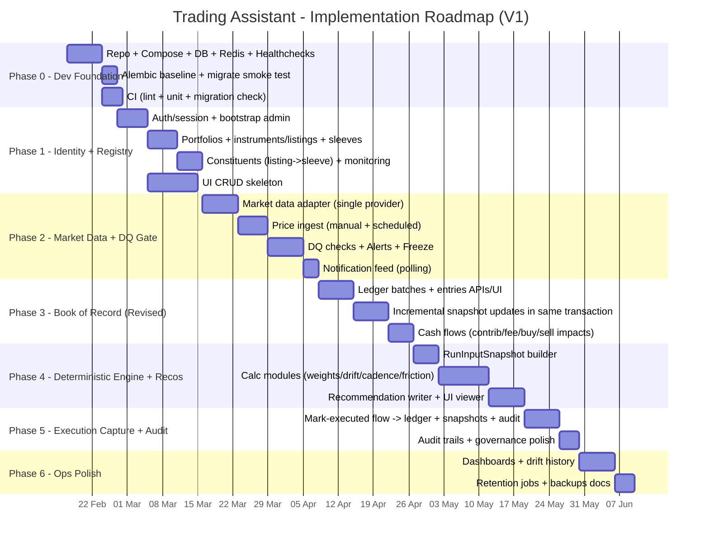
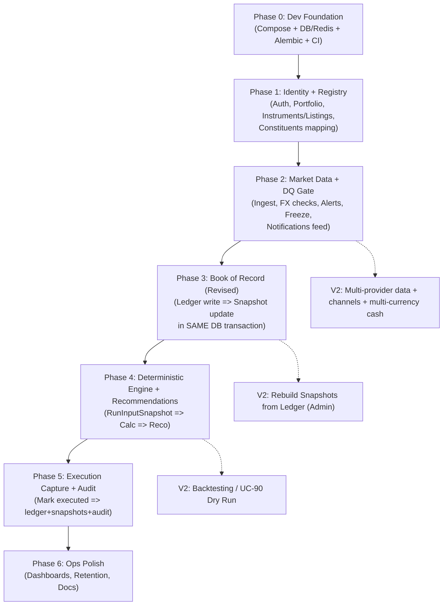

# Trading Assistant — Delivery Plan (V1 → V2)

_Last updated: 2026-02-14 (UTC)_

This document defines the implementation roadmap, phased delivery approach, scope boundaries, and exit criteria for V1, with clear deferrals to V2.

---

## 0) Goals and constraints (V1)

**Primary goals**
- Reliable and auditable “agent” workflow: **ingest → validate → run → recommend → review → execute capture → audit**
- Operational simplicity: portable **Docker Compose**, no cloud dependency for core operation
- Security: DB not exposed; least-privilege connectivity; secrets not in git; freeze/kill semantics
- Low-friction execution: recommendations respect **max orders** and **min trade** constraints

**V1 constraints**
- Base currency: **GBP** (single-currency cash ledger)
- Market data: **single provider** to start (adapter abstraction retained)
- Notifications: **in-app polling feed** (DB-backed)

---

## 1) Phase overview (what ships when)

### Phase 0 — Dev Foundation
**Outcome:** a reproducible environment that can run migrations and pass smoke tests.

Deliverables:
- Repo layout (ui/api/scheduler/worker/db)
- Docker Compose: Postgres + Redis + API + Worker + Scheduler + UI
- Alembic baseline migration wired to `DATABASE_URL`
- Health checks and basic CI (lint/test/migration check)

Exit criteria:
- `docker compose up` starts cleanly
- `alembic upgrade head` succeeds
- API health endpoint returns OK

---

### Phase 1 — Identity + Registry
**Outcome:** you can sign in and configure portfolio universe.

Scope:
- Auth/session + bootstrap admin
- Portfolio CRUD
- Instruments + listings (venue currency/scale)
- Sleeve mapping via `portfolio_constituents`
- Monitoring flags

Exit criteria:
- User can log in
- Portfolio + listings + sleeve mappings visible in UI
- API enforces portfolio tenancy checks

---

### Phase 2 — Market Data + Data Quality Gate
**Outcome:** robust ingestion with safety guardrails (alerts/freeze).

Scope:
- Market data adapter (single provider)
- Price ingestion (manual + scheduled; intraday + EOD)
- FX ingestion (as needed for validation)
- Data quality engine (UC-22/23): stale/missing/jump/scale mismatch/FX mismatch/market closed awareness
- Alerts + freeze semantics
- Notification feed rows for critical events

Exit criteria:
- Scheduled price refresh writes `price_points` idempotently (`ON CONFLICT ...`)
- DQ failure produces Alert and (optionally) Freeze; recommendations blocked while frozen
- TaskRuns recorded with status and summary

---

### Phase 3 — Book of Record (Revised MVP)
**Outcome:** ledger is append-only truth; snapshots update **incrementally** in the same transaction.

Key decision (V1):
- **Do NOT implement a general replay engine.**
- Update `holding_snapshots` and `cash_snapshots` **incrementally** in the same DB transaction that writes a `ledger_entry`.

Scope:
- Ledger batches + ledger entries
- Cash flows (contribution/fee/buy/sell impacts)
- Incremental snapshot update logic (atomic)

Exit criteria:
- Writing ledger entries updates snapshots atomically and consistently
- Reads use snapshots (not replay) for UI “current state”
- Idempotency: duplicate submit does not double-apply (use entry IDs + unique constraints)

V2 deferred:
- Admin “Rebuild snapshots from ledger” tool

---

### Phase 4 — Deterministic Calculation Engine + Recommendations
**Outcome:** deterministic judge+advise engine produces explainable recommendations under constraints.

Scope:
- RunInputSnapshot builder (captures holdings/cash/prices/policy hashes)
- Calculation modules:
  - valuation in base currency
  - sleeve weights + drift detection
  - cadence allocator (monthly/quarterly)
  - friction filter (min trade, max orders)
  - wave triggers + sunset clause checks (as per policy)
- Recommendation writer + order lines + constraints report
- UI recommendation viewer (rationale + triggered rules)

Exit criteria:
- Given the same RunInputSnapshot + policy hash, recommendation output is reproducible
- Recommendations show triggered rules and constraint compliance

---

### Phase 5 — Execution Capture + Audit Trail
**Outcome:** close the loop after broker execution; preserve full auditability.

Scope:
- “Mark executed” workflow: write ledger entries (fills/fees/time) + update snapshots
- AuditEvent on key actions: approve strategy, freeze/unfreeze, execute recommendation, ignore recommendation
- Optional: LLM reviewer for recommendations (PASS/WARN/FAIL) stored with recommendation

Exit criteria:
- Recommendation → manual broker execution → mark-executed → updated portfolio state
- Audit events exist for all key state transitions

---

### Phase 6 — Ops Polish
**Outcome:** run unattended; user-friendly dashboards; housekeeping.

Scope:
- Dashboards: value, sleeve weights, drift history, run history
- Retention jobs for snapshots/alerts/notifications
- Backup/restore playbook
- Observability: structured logs, health checks, basic metrics (optional)

Exit criteria:
- Unattended operation without data bloat
- Clear operational runbook exists

---

## 2) What is deferred to V2 (high ROI deferrals)

**Strong V2 candidates**
1. **Backtesting / UC-90 Dry Run** (historical sourcing + CA correctness + reporting)
2. **Corporate actions beyond split/merge MVP** (ISIN changes, complex merges/spin-offs)
3. **Multi-provider market data with failover** (costly testing)
4. **External notification channels** (Telegram/Email/Slack/WebPush)
5. **LLM-driven manifesto change workflows** (governance complexity)
6. **Multi-currency cash ledger**
7. **Portfolio sharing / membership (N:M)** if not required immediately
8. **DB partitions + JSONB GIN indexes** (only if real scale/query pressure)

---

## 3) Minimal test strategy — when and how

### What you should define early (before heavy implementation)
Define **testable invariants** (short, stable):
- **Determinism:** same snapshot + policy hash → same reco lines
- **Safety:** DQ failure → alert (+ optional freeze) and **no advice**
- **Idempotency:** duplicate job/submit does not double-apply effects
- **Auditability:** key state transitions create audit events

---

## 4) Roadmap diagrams (MermaidJS)

### 4.1 Gantt roadmap

### 4.2 Dependency flow

---

## 5) Work products checklist (what docs/artifacts exist per phase)

- Phase 0: docker-compose.yml, Alembic baseline, repo skeleton, health endpoints
- Phase 1: OpenAPI skeleton (auth/registry), UI pages scaffold
- Phase 2: Market data adapter spec + DQ rules spec + run/audit write paths
- Phase 3: Ledger contract + snapshot update logic spec (transaction semantics)
- Phase 4: Calculation modules spec + recommendation schema + fixtures
- Phase 5: Execution capture spec + audit events catalog
- Phase 6: Ops runbook + retention schedules + dashboards

---

## 6) Definition of Done (V1)

V1 is “done” when:
- The system runs continuously (scheduler+worker) without manual babysitting
- Data quality issues block recommendations safely (alerts/freeze)
- Monthly/quarterly recommendations are generated deterministically from policy
- You can record broker executions and the portfolio state remains correct and auditable

